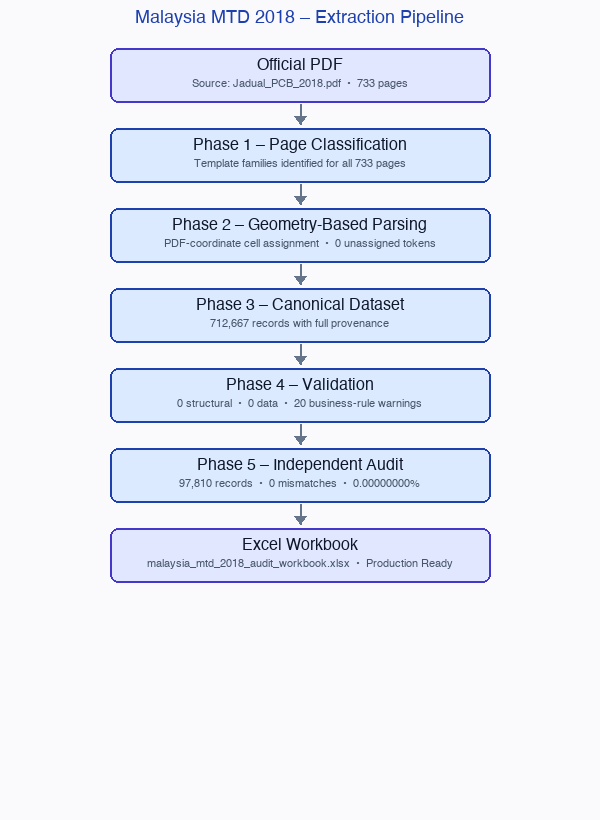

# Malaysian 2018 Monthly Tax Deduction (MTD/PCB) Conversion Project

## Overview

This repository contains the complete conversion of the official Malaysian 2018 Monthly Tax Deduction (MTD/PCB) schedule from PDF format into a structured, searchable, and auditable Excel workbook.

The project was designed with one primary objective:

> **Produce a spreadsheet that accurately represents the official government PDF while maintaining full traceability back to the original source document.**

Because tax data is highly sensitive and errors can create compliance risks, the project was built using a **validation-first approach** rather than a simple PDF-to-Excel conversion.

---

## Executive Summary

### Source Document
- Official Malaysian 2018 MTD/PCB Schedule PDF
- Total pages processed: **733**

### Final Output
- Audit-ready Excel workbook
- Searchable and filterable dataset
- Full traceability to source PDF

### Final Dataset
- Parsed rows: **33,145**
- Canonical records: **712,667**
- Assigned cell values: **778,957**

### Validation Results

| Metric | Result |
|--------|--------|
| Pages processed | 733 |
| Parsed rows | 33,145 |
| Canonical records | 712,667 |
| Unassigned data tokens | 0 |
| Duplicate cell assignments | 0 |
| Validation failures | 0 |
| Independent audit mismatches | 0 |

### Release Status

**READY FOR PRODUCTION**

---

## Repository Structure

```
Official PDF
│
├── scripts/               Python extraction pipeline (Phases 1–6)
├── phase1_discovery_output/
├── phase2_parser_prototype_output/
├── phase3_full_parse_output/
├── phase4_canonical_output/
├── phase5_independent_audit_output/
├── final_release_output/  Final workbook and release reports
├── docs/                  Pipeline diagram and supporting documentation
└── malaysia_mtd_2018_final_release.zip
```

### Key Deliverables

- `final_release_output/malaysia_mtd_2018_audit_workbook.xlsx`
- `final_release_output/final_release_report.md`
- `final_release_output/final_project_summary.md`
- `final_release_output/claude_final_verification_report.md`
- `malaysia_mtd_2018_final_release.zip`

---

## Extraction Pipeline



---

## Project Goals

The goal was not simply to extract data.

The goal was to:

1. **Preserve accuracy.**
2. **Preserve auditability.**
3. **Preserve provenance.**
4. **Minimize manual intervention.**
5. **Eliminate silent data corruption.**

Examples of issues specifically designed against:

- Column shifting
- Missing values
- Incorrect row alignment
- PDF parsing errors
- Duplicate records
- Loss of source traceability

---

## Conversion Methodology

### Phase 1 – Discovery

The PDF was analyzed to understand:
- Page layouts
- Table structures
- Header formats
- Salary band organization
- Section boundaries

This phase identified two major data sections:

| Section | Columns |
|---------|---------|
| A | KA1 – KA10 |
| B | KA11 – KA20 |

The document was not one uniform table and required section-aware parsing.

---

### Phase 2 – Page Classification

All 733 pages were classified into template families:

- Intro pages
- Standard data pages
- Cover pages
- Final partial pages

**Result:** Every page was successfully classified.

---

### Phase 3 – Geometry-Based Parsing

The parser uses **PDF coordinates** rather than simple text extraction.

Instead of assuming:
```
Value 1 = Column 1
Value 2 = Column 2
```

the parser determines:
```
This value appears inside the physical location of Column X
```

This design prevents column-shift corruption.

---

### Phase 4 – Canonical Dataset Generation

A canonical dataset was created. Each record includes:

- Salary range
- Category
- Dependent code
- Deduction value
- Source page
- Source location
- Validation metadata

The canonical dataset is the source of truth. The Excel workbook is generated from the canonical dataset.

---

### Phase 5 – Independent Audit Verification

An independent verification pass was performed using a completely separate extraction method.

| Method | Tool |
|--------|------|
| Production extraction | `pdfplumber` + geometry-based parsing |
| Audit extraction | `pdfminer.six` + line-based parsing |

**Results:**
- Pages audited: **100**
- Records audited: **97,810**
- Mismatches: **0**
- Mismatch rate: **0.00000000%**

---

## Validation Strategy

The project uses multiple validation layers.

### Structural Validation

Checks:
- Page counts
- Row counts
- Template consistency
- Salary range integrity
- Duplicate detection

**Result: 0 failures**

---

### Data Validation

Checks:
- Numeric parsing
- Missing values
- Invalid values
- Unexpected records

**Result: 0 failures**

---

### Business Rule Validation

Checks:
- Unexpected deduction changes
- Outlier values
- Suspicious patterns

**Result:** 20 warnings identified. All 20 warnings were manually reviewed and confirmed as legitimate values present in the official PDF.

---

## Why This Workbook Can Be Trusted

The workbook was not generated using a single extraction step.

The workflow included:

1. PDF classification
2. Geometry-based parsing
3. Canonical dataset generation
4. Validation checks
5. Independent audit verification
6. Release verification

**Final statistics:**
- 733 pages processed
- 712,667 canonical records
- 97,810 independently audited records
- 0 mismatches
- 0 validation failures

Every value can be traced back to:

```
Workbook Cell
     ↓
Canonical Record
     ↓
Parsed Grid
     ↓
PDF Page
     ↓
Official PDF
```

---

## Frequently Asked Questions

**What is the source of this data?**

The official Malaysian 2018 Monthly Tax Deduction (MTD/PCB) PDF published by the relevant tax authority.

---

**Why not use the PDF directly?**

The PDF is difficult to search, filter, query, and integrate into business systems. The spreadsheet provides a structured representation while preserving traceability to the original source.

---

**Why should I trust this spreadsheet?**

1. Every page was classified and validated.
2. Every cell was assigned using PDF coordinates.
3. The parser produced 0 unassigned data tokens and 0 duplicate cell assignments.
4. The canonical dataset produced 0 validation failures.
5. An independent audit reviewed 100 pages, 97,810 records, and found 0 mismatches.

No evidence of systematic extraction errors was found.

---

**Was the spreadsheet manually typed?**

No. The spreadsheet was generated programmatically from the PDF using a validated extraction pipeline.

---

**How can a value be traced back to the original PDF?**

Every record contains provenance information:

```
Workbook → Canonical Dataset → Parsed Grid → PDF Page → Official PDF
```

---

**Were any tax values changed?**

No. The project intentionally avoids modifying tax values. Observed dashes remain dashes. Warnings were reviewed but not altered.

---

**What happens if a discrepancy is discovered in the future?**

The repository contains the original PDF, extraction scripts, validation reports, audit reports, and final workbook. The entire process can be reproduced and independently verified.

---

## Final Status

### Production Ready

The workbook has been:

- Extracted
- Validated
- Audited
- Verified
- Packaged

and is approved for operational use.
